::: div pb-10 mb-10 border-b border-warmGrey-200
::: div max-w-5xl my-6 mx-auto
In 1869, Joseph Minard, a retired French engineer, put pen to paper and created this classic with nothing more than his brain, some data, a ruler, and two colors of ink. [This graphic](http://en.wikipedia.org/wiki/Charles_Joseph_Minard#Work) is often cited as one of the first data visualizations created.
:::
::: div max-w-screen-xl mx-auto 

:::
:::

::: div lg:grid lg:grid-cols-2 mb-12
::: div lg:border-r lg:border-warmGrey-200 mb-6

:::
::: div lg:max-w-3xl
Back then, to tell stories with data, you needed to be a little bit of a engineer, a little bit of a designer. Visionary, too.
:::
:::

::: div lg:grid lg:grid-cols-2 mb-12
::: div lg:border-r lg:border-warmGrey-200 mb-6

:::
::: div lg:max-w-3xl
Fast forward to not-long-ago, and building the exact same visualization procedurally requires a few more skills, because our medium has shifted to the screen. All of a sudden you’re a little bit engineer, a little bit designer, a little bit software developer. Maybe you were targeting the web, but maybe you were just building a static graphic. Even if you were targeting the web, there wasn’t too much interaction — the technology wasn’t there yet for people to build these things with a reasonable amount of effort, and the technology wasn’t there on the client side for enough people to be able to view them.

Either way, “software engineer” became a part of our job description.
:::
:::

::: div lg:grid lg:grid-cols-2 mb-12
::: div lg:border-r lg:border-warmGrey-200 mb-6
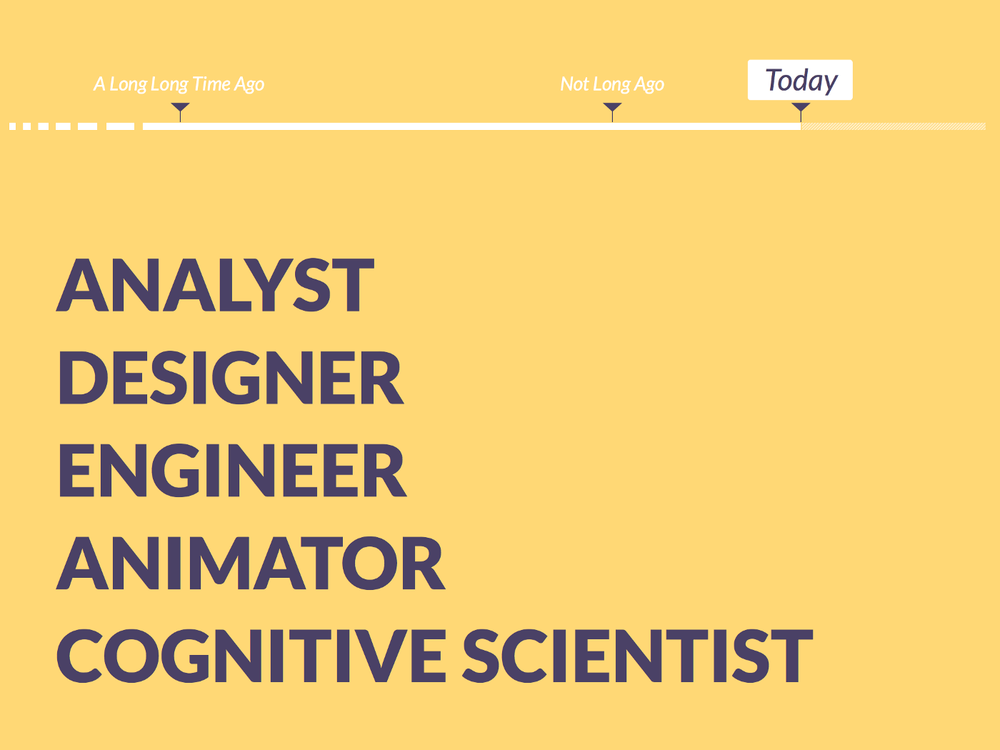
:::
::: div lg:max-w-3xl
Now the web is everywhere, and because of that, it’s the medium we target when making things. We’ve also crossed a tipping point with hardware; most people have powerful hardware on their desks or in their pockets. We can build and deploy interactive stories.

The most significant change, though, is animation. It’s still resource constrained — hard to do well for mobile browsers, or older computers, or across all different browsers and operating systems. Apple created expectations here, making animation a first-class part of interface design, and creating a desire for animation and delight in computing.

It isn’t just about user delight, but practicality. Animations show us where things came from, give hints about their possible behavior, where they might go. It’s an additional channel of information for us to use.
:::
:::

::: div lg:grid lg:grid-cols-2 mb-12
::: div lg:border-r lg:border-warmGrey-200 mb-6
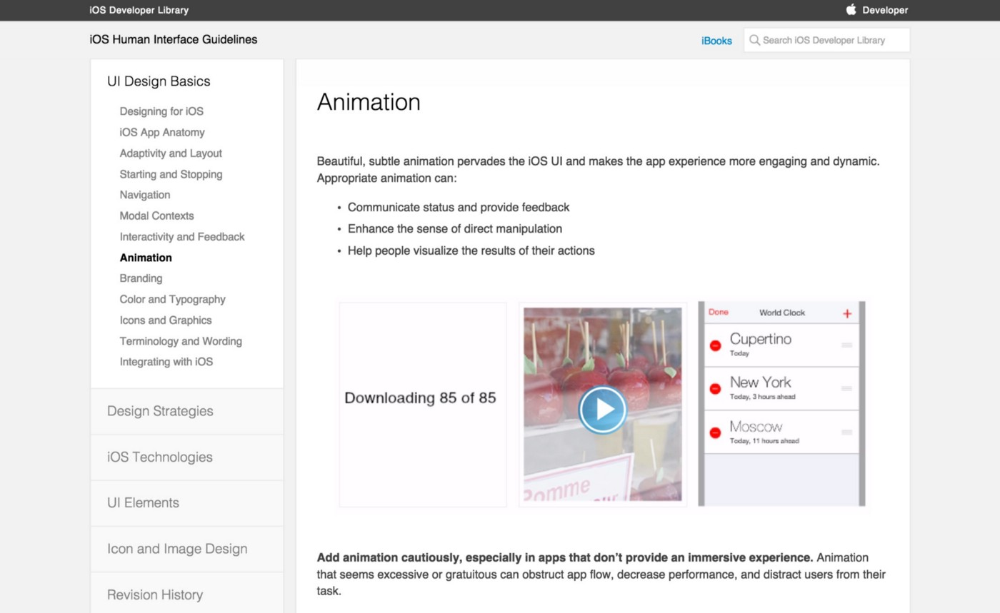
:::
::: div lg:max-w-3xl
Apple got explicit about this, documenting the proper usage of animation when building apps for their platforms.
:::
:::

::: div lg:grid lg:grid-cols-2 mb-12
::: div lg:border-r lg:border-warmGrey-200 mb-6
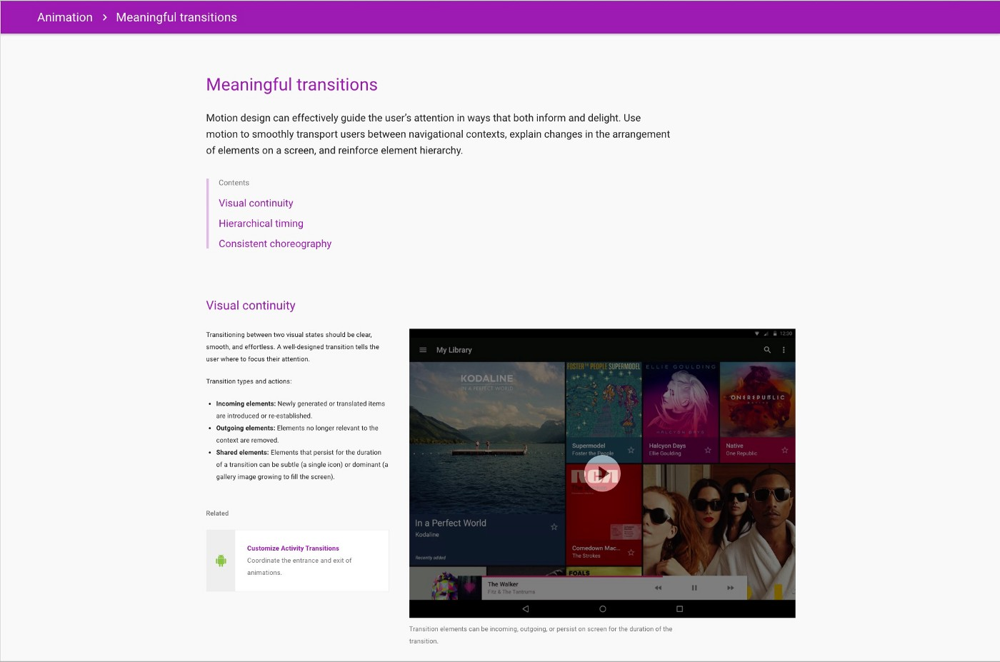
:::
::: div lg:max-w-3xl
Google was a bit later to the party, but showed up with a very comprehensive approach to animation in the shape of their “Material Design” guidelines.
:::
:::

::: div lg:grid lg:grid-cols-2 mb-6 
::: div lg:border-r lg:border-warmGrey-200 justify-self-end
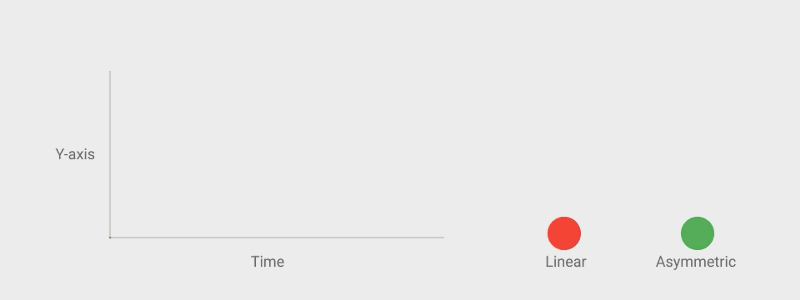
:::
::: div lg:max-w-3xl
It talks about animation timing and curves, showing how to make motion feel natural.
:::
:::

::: div lg:grid lg:grid-cols-2 mb-12
::: div lg:border-r lg:border-warmGrey-200 mb-6 justify-self-end

:::
::: div lg:max-w-3xl
It also talks about using animation to guide the eye and establish visual hierarchy — both things that we struggle with when designing our visuals, our stories.
:::
:::

::: div lg:grid lg:grid-cols-2 mb-12
::: div lg:border-r lg:border-warmGrey-200 mb-6

:::
::: div lg:max-w-3xl
In addition to everything from before, animation has become something default that people expect of good interfaces. And now, all of a sudden we’re responsible for animation, and an understanding of how humans perceive images in motion, further mutating our job titles.
:::
:::

::: div lg:grid lg:grid-cols-2 mb-12
::: div lg:border-r lg:border-warmGrey-200 mb-6

:::
::: div lg:max-w-3xl
My name is Idan Gazit, and I tell stories with data.
:::
:::

::: div lg:grid lg:grid-cols-2 mb-12
::: div lg:border-r lg:border-warmGrey-200 mb-6

:::
::: div lg:max-w-3xl
I work at Heroku, which is the internet’s largest PaaS, which is fun because…
:::
:::

::: div lg:grid lg:grid-cols-2 mb-12
::: div lg:border-r lg:border-warmGrey-200 mb-6
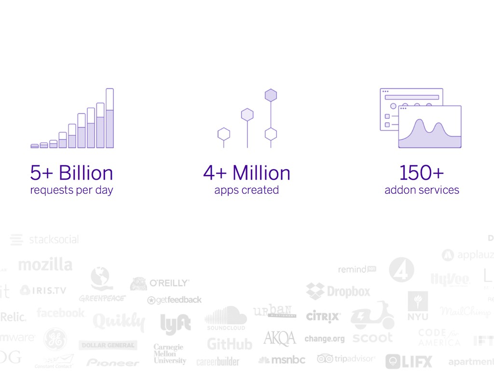
:::
::: div lg:max-w-3xl
We have a lot of users, and a lot of data, and a lot of interesting stories to tell around those users and that data.
:::
:::

::: div my-20 py-10 border-t border-b border-warmGrey-200
::: div max-w-screen-xl mx-auto 
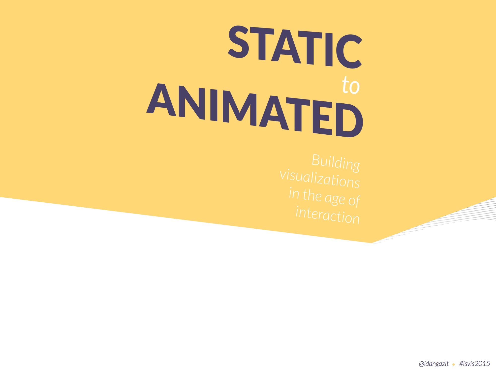
:::
::: div max-w-5xl my-6 mx-auto
This is a talk about how animation is changing our craft. It’s a little bit about about the people making, building, and telling these stories. It’s also about the tools and techniques we use to build data stories for the modern web, and how they can help us achieve two things:
:::
:::

::: div lg:grid lg:grid-cols-2 mb-12
::: div lg:border-r lg:border-warmGrey-200 mb-6

:::
::: div lg:max-w-3xl
How can we expand the boundaries of our ability to ship more stories, to ship better stories, and to ship stories better? Particularly when it comes to building stories with pervasive animation.
:::
:::

::: div lg:grid lg:grid-cols-2 mb-12
::: div lg:border-r lg:border-warmGrey-200 mb-6
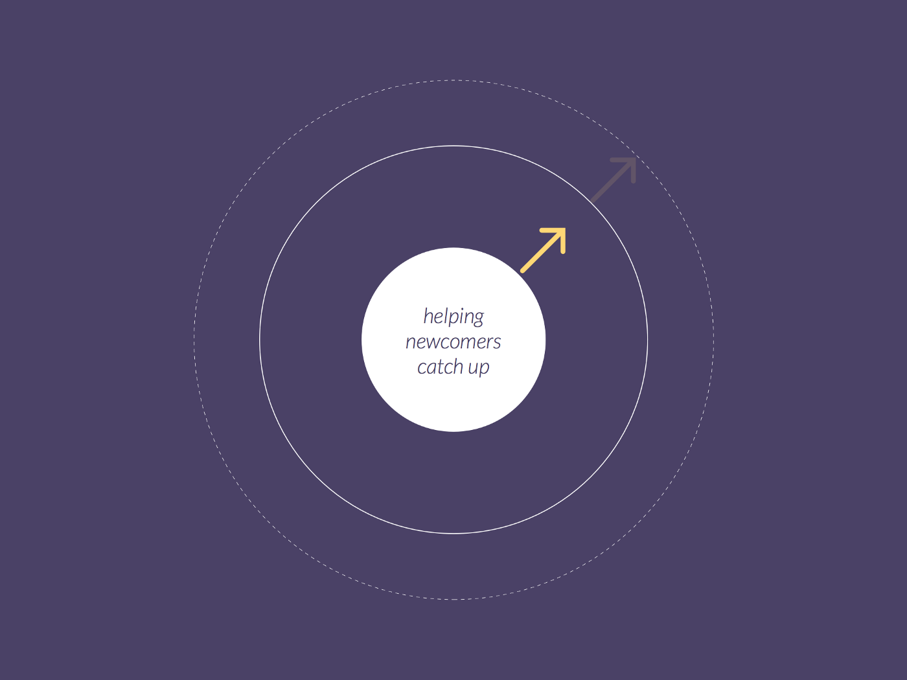
:::
::: div lg:max-w-3xl
And how are we going to help democratize access to our field? How can we make our toolbox easier to use? Because it’s clear that good data stories are everywhere, and helping people tell their own stories is probably the most impactful thing we can do in the service of science. It’s also clear that adding animation is a major change to our craft, a huge additional hurdle for newcomers to clear.
:::
:::

::: div lg:grid lg:grid-cols-2 mb-12
::: div lg:border-r lg:border-warmGrey-200 mb-6
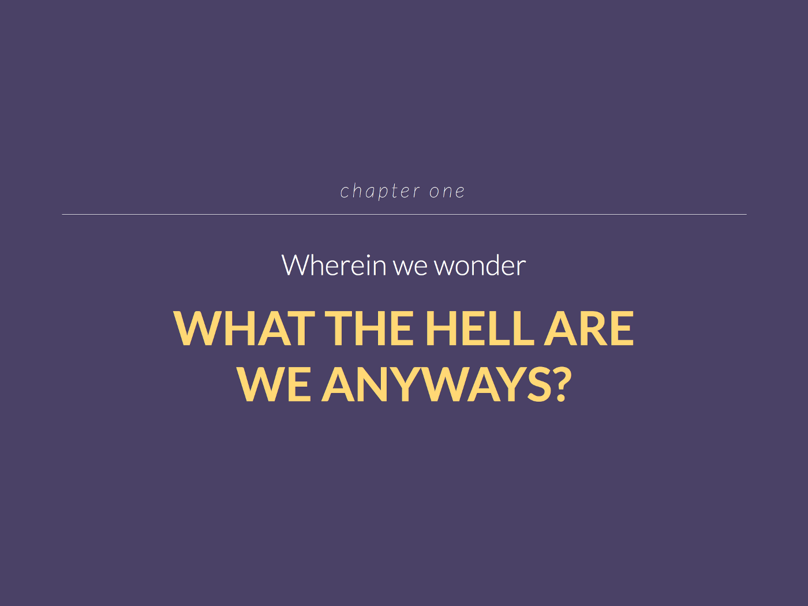
:::
::: div lg:max-w-3xl
Maybe the first problem that we have with getting more people into data storytelling is a marketing problem. We kinda suck at communicating what it is that we do, and by extension, what they’re getting into.

How many of you work in the field and have trouble articulating what it is that you do in one or two words, like normal people’s job descriptions?
:::
:::

::: div lg:grid lg:grid-cols-2 mb-12
::: div lg:border-r lg:border-warmGrey-200 mb-6
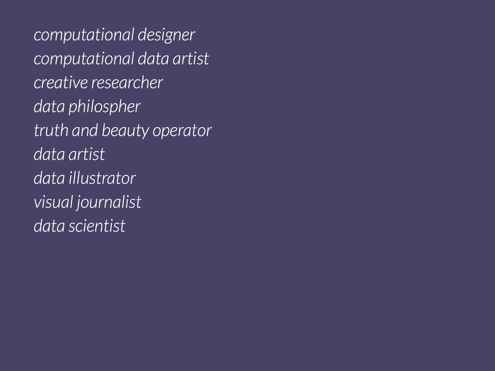
:::
::: div lg:max-w-3xl
A friend of mine went to Eyeo Festival. While she was there, she collected the job titles she saw. Some try to be practical, some not so much.
:::
:::

::: div lg:grid lg:grid-cols-2 mb-12
::: div lg:border-r lg:border-warmGrey-200 mb-6
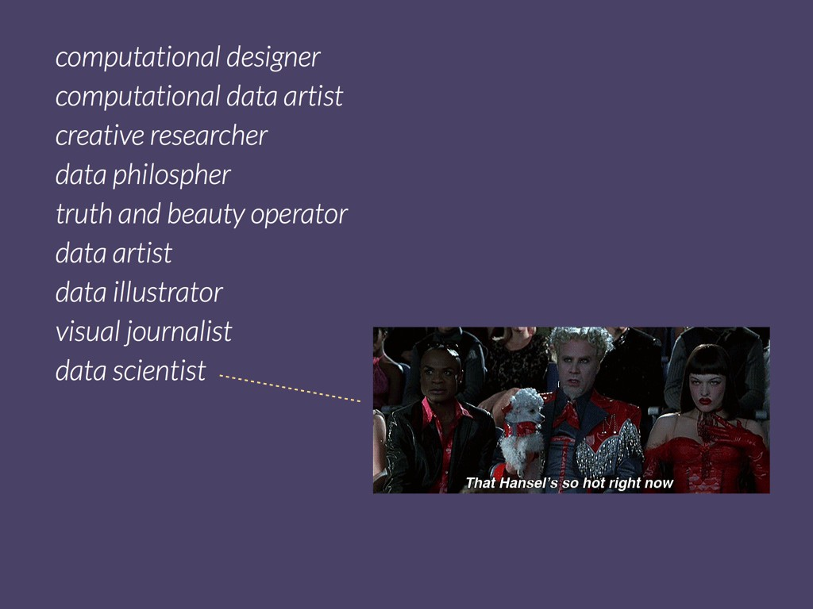
:::
::: div lg:max-w-3xl
Then there’s the ever-popular “Data Scientist.” The term is so broadly defined as to be almost meaningless. About the only thing that people agree on when it comes to data science is that you can probably make a lot of money if you can call yourself a data scientist.
:::
:::

::: div lg:grid lg:grid-cols-2 mb-12
::: div lg:border-r lg:border-warmGrey-200 mb-6
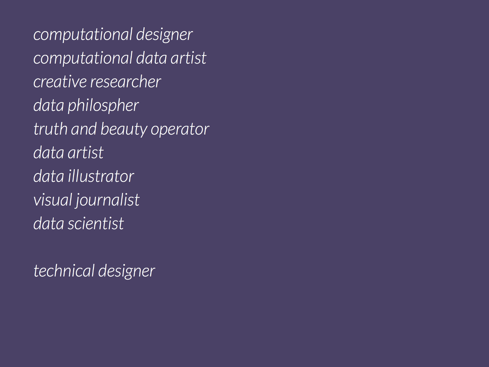
:::
::: div lg:max-w-3xl
Another friend of mine once introduced me to someone as a “technical designer”. I liked that and wore it for a while.
:::
:::

::: div lg:grid lg:grid-cols-2 mb-12
::: div lg:border-r lg:border-warmGrey-200 mb-6
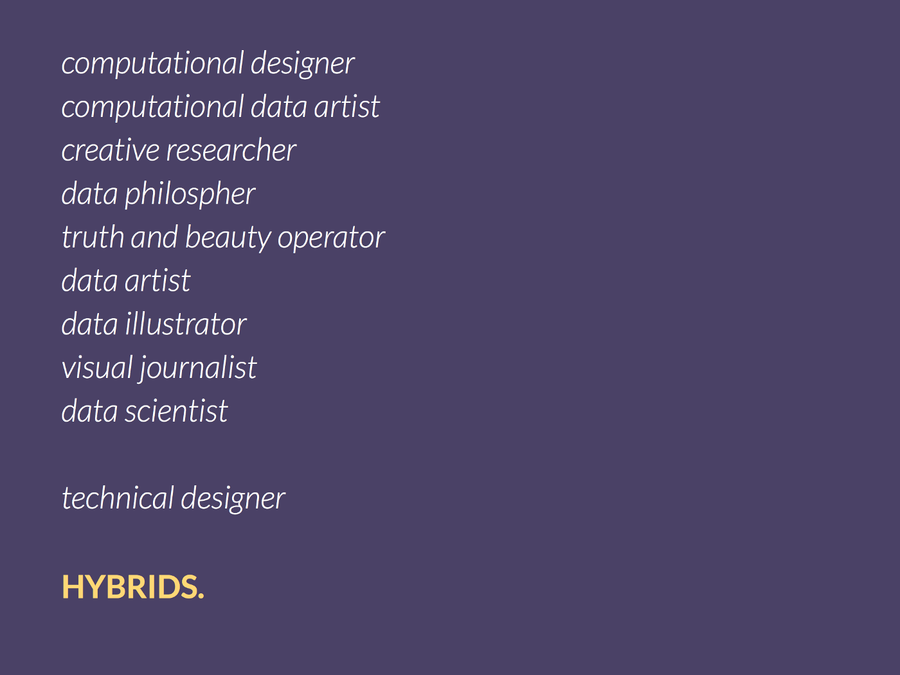
:::
::: div lg:max-w-3xl
The only thing that really binds us all together is that we’re hybrids of one form or another, wearing a few different hats.
:::
:::

::: div lg:grid lg:grid-cols-2 mb-12
::: div lg:border-r lg:border-warmGrey-200 mb-6
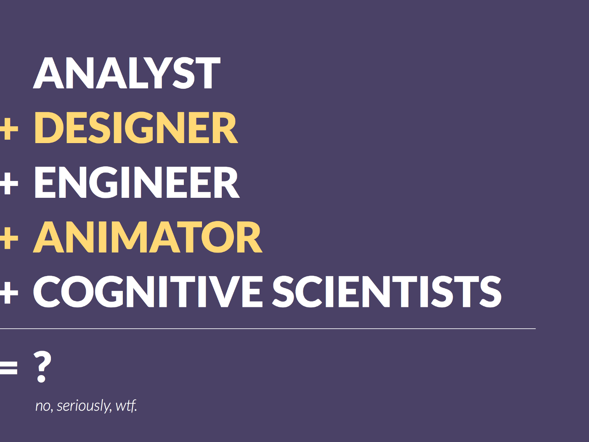
:::
::: div lg:max-w-3xl
Which should be like, totally obvious, since we’re supposedly analyst designer software engineer animator cognitive scientists.
:::
:::

::: div lg:grid lg:grid-cols-2 mb-12
::: div lg:border-r lg:border-warmGrey-200 mb-6
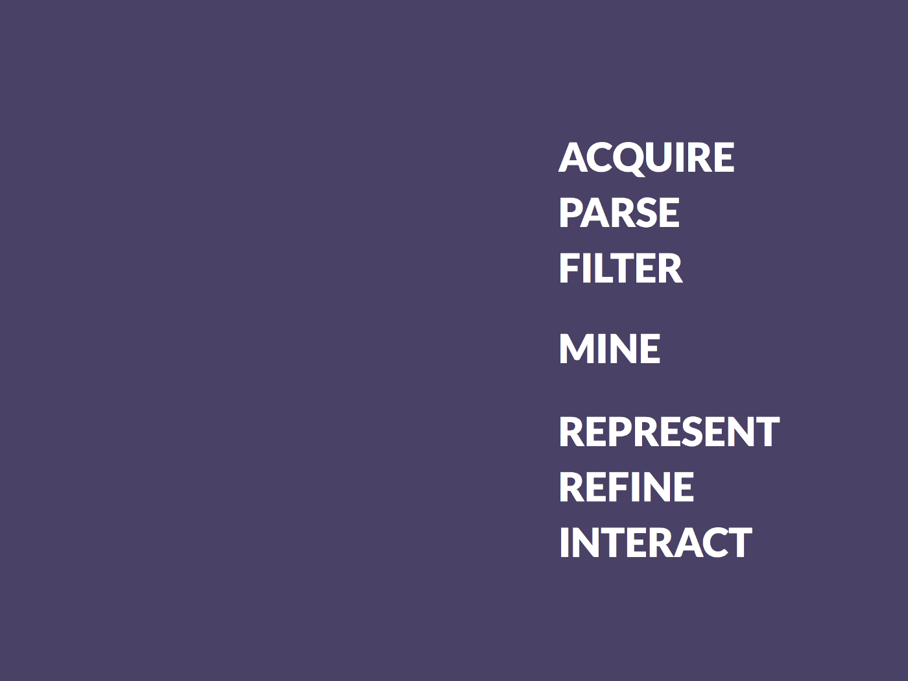
:::
::: div lg:max-w-3xl
So let’s look at it from the flipside — how do we categorize the work that we do?

Ben Fry’s famously enumerated “seven steps of data visualization” is great, but it’s a little more granular than I want when I’m describing what our field is about.
:::
:::

::: div lg:grid lg:grid-cols-2 mb-12
::: div lg:border-r lg:border-warmGrey-200 mb-6
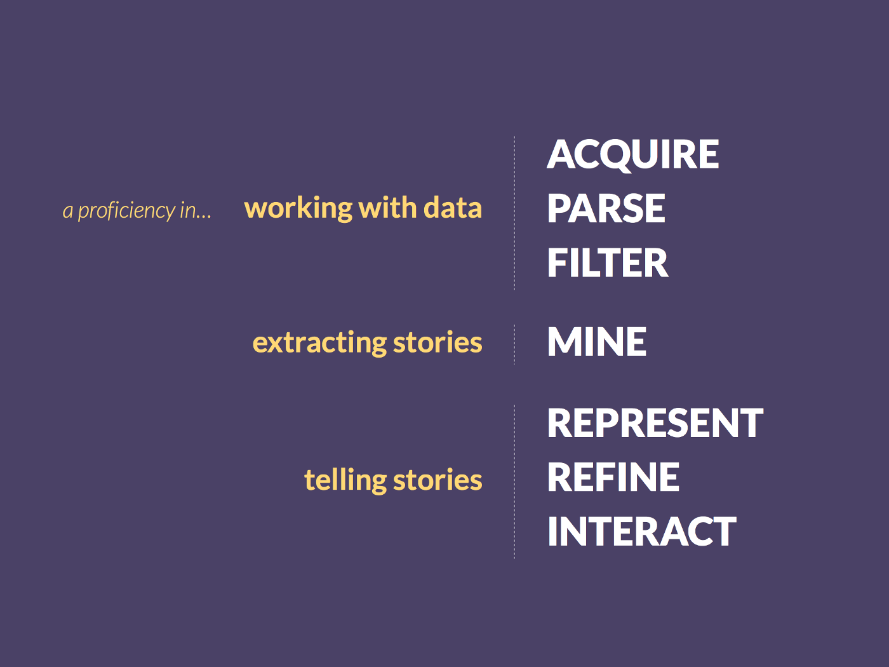
:::
::: div lg:max-w-3xl
I think that what we do breaks down into these three basic abilities. We have tools and techniques for working with data at scale, fishing some meaningful story from that data, and then turning around and telling that story.
:::
:::

::: div lg:grid lg:grid-cols-2 mb-12
::: div lg:border-r lg:border-warmGrey-200 mb-6
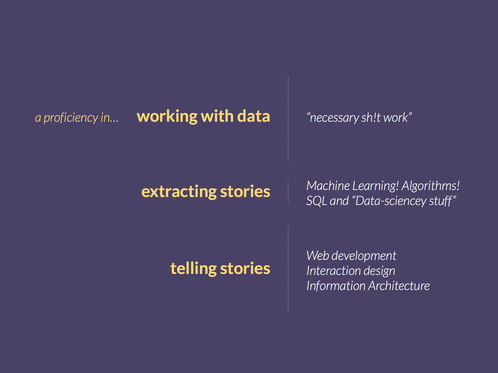
:::
::: div lg:max-w-3xl
Practically speaking, this is what those parts of work entail.

Animation only affects the last one, but it’s a doozy. You might think that adding animation is like adding another item to that list…
:::
:::

::: div lg:grid lg:grid-cols-2 mb-12
::: div lg:border-r lg:border-warmGrey-200 mb-6

:::
::: div lg:max-w-3xl
The effort involved for everything in that list is easily double, and climbs rapidly if you want to deliver something polished for “everyone” on “every device”. Animation also introduces a whole additional dimension to the design process, because now you need to be designing for all kinds of transitional states — the states between things.
:::
:::

::: div lg:grid lg:grid-cols-2 mb-12
::: div lg:border-r lg:border-warmGrey-200 mb-6

:::
::: div lg:max-w-3xl
It was bad enough without animation — as designers for the medium of the web, we have almost no control over how and where our content is consumed. The web, as a medium, is defined by its nonuniformity. There are endless screen geometries, with disparate color calibrations, pixel densities, and OSes with their assortment of type rendering engines.

There are people ingesting your content on a smartphone, in a busy train station in daylight, with one thumb and one eye, while others come by at night, from their desks, with three monitors and their full attention.
:::
:::

::: div lg:grid lg:grid-cols-2 mb-12
::: div lg:border-r lg:border-warmGrey-200 mb-6

:::
::: div lg:max-w-3xl
Even without animation, it’s hard to build things that are guaranteed to present equally well on all screens. Adding animation makes it even more likely that some part of your audience is experiencing your carefully-designed thing… from a weird angle.

There’s nothing you can do to prevent people from walking around to the ass end of the thing you’re sculpting. This inability to curate our audience’s experience is a staple part of every designer’s Diet of Despair™. Making peace with this lack of control is the hallmark of designers who are acquiring the language of interaction as a native tongue.
:::
:::

::: div lg:grid lg:grid-cols-2 mb-12
::: div lg:border-r lg:border-warmGrey-200 mb-6
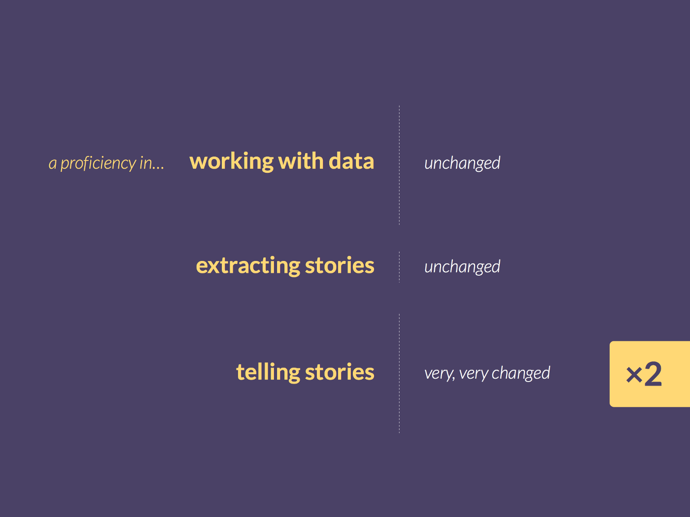
:::
::: div lg:max-w-3xl
The storytelling part of the work is growing dramatically in scope. This is what your audience actually sees and interacts with, and they’re starting to develop standards about what’s good. When you look at the web-vs-native-app debate in mobile, pervasive animation is a big part of what makes native attractive. Interaction without animation feels soulless and dated.

If it was hard to find one person to cover the frontend role beforehand, now you’re even less likely to find such a “do it all” unicorn — let alone people who can deliver on the entire data visualization workflow.

If we want to make it easier for newcomers to break in, we must be honest about what part of the work we expect them to be able to be able to handle. Splitting up the responsibilities among a larger team is becoming less an option and more of a necessity.
:::
:::

::: div lg:grid lg:grid-cols-2 mb-12
::: div lg:border-r lg:border-warmGrey-200 mb-6
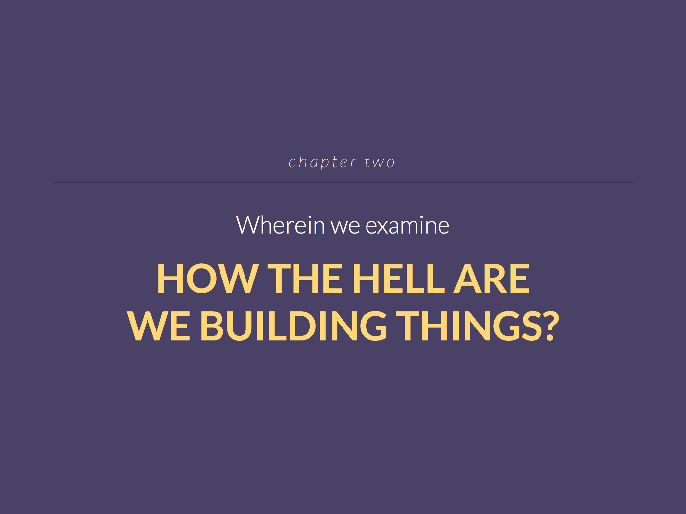
:::
::: div lg:max-w-3xl
Getting more people into our field and setting them up for success is great, but what’s the state of affairs for those of us who are already here?
:::
:::

::: div lg:grid lg:grid-cols-2 mb-12
::: div lg:border-r lg:border-warmGrey-200 mb-6
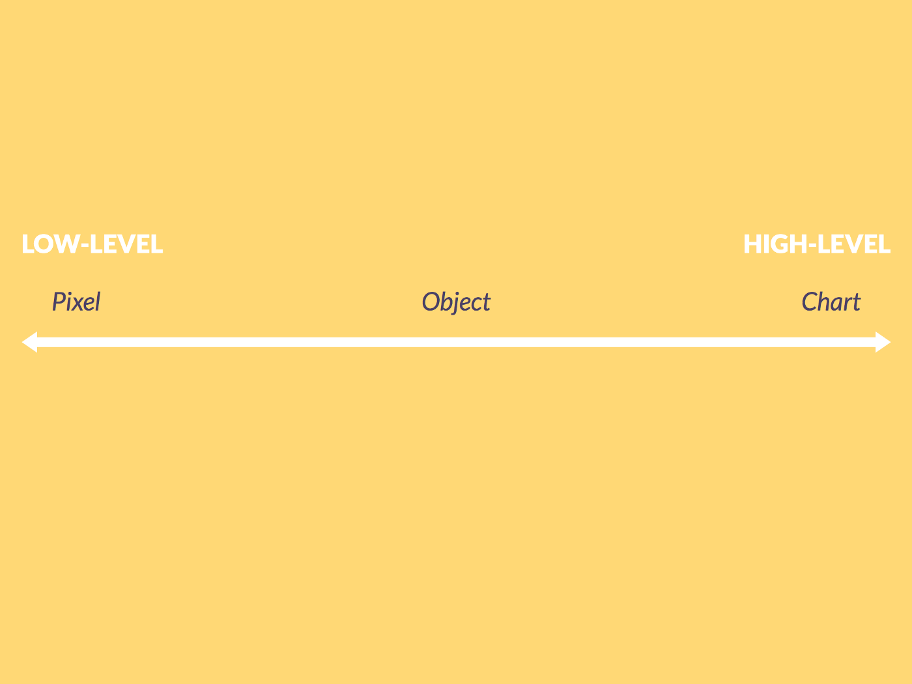
:::
::: div lg:max-w-3xl
At a high level, visualization tools for the web lie somewhere on this spectrum.
:::
:::

::: div lg:grid lg:grid-cols-2 mb-12
::: div lg:border-r lg:border-warmGrey-200 mb-6
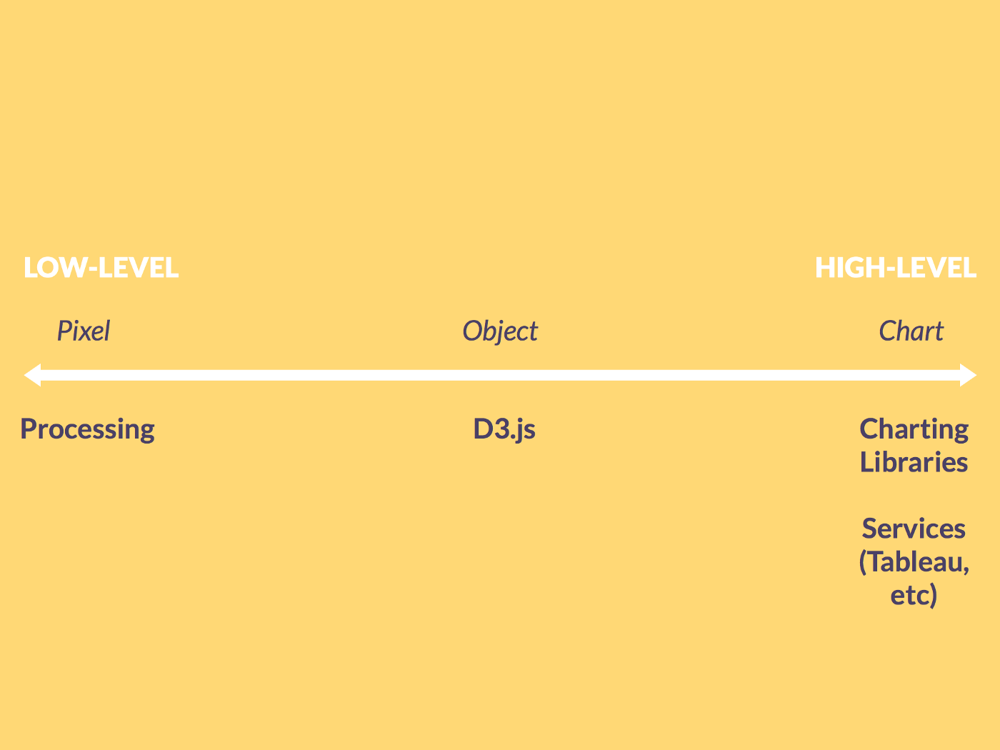
:::
::: div lg:max-w-3xl
Low-level we have tools that think in terms of pixels and draw operations, like Processing. There’s no concept of visual objects. It’s entirely up to you to manage the pixels being drawn, one by one. This affords the greatest control, but you have to pay the complexity tax over and over again. With animation, it’s up to you to decide how to draw every frame, over and over.

High-level, we have tools that take data and give you back… something fully baked. If the tool does what you need, great! If not, you’re going to be frustrated. Mostly, these generic tools have generic visualizations — charts of some kind or another. You usually can’t affect the way they render.

The sweet spot right now is in the middle, where we enjoy more control than the high-level and more handy abstractions than the low level.

But what do we mean by “objects”, and why is D3 such a Big Deal™? Well, first a quick primer about how web content works.
:::
:::

::: div lg:grid lg:grid-cols-2 mb-12
::: div lg:border-r lg:border-warmGrey-200 mb-6
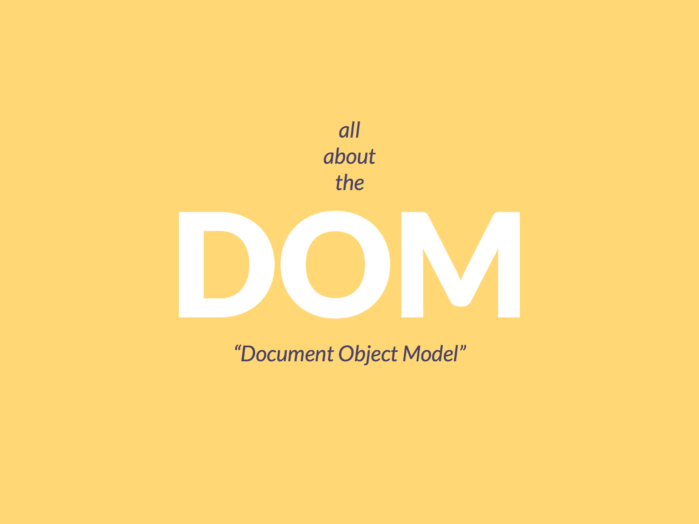
:::
::: div lg:max-w-3xl
The DOM is a tree — a data structure — that describes the structure of the content in a webpage.
:::
:::

::: div lg:grid lg:grid-cols-2 mb-12
::: div lg:border-r lg:border-warmGrey-200 mb-6 justify-self-end

:::
::: div lg:max-w-3xl
It’s a tree, where the root element represents the entire browser window. Browsers take HTML and build this tree for every page you visit on the we. You can read this tree and alter it in JavaScript.
:::
:::

::: div lg:grid lg:grid-cols-2 mb-12
::: div lg:border-r lg:border-warmGrey-200 mb-6
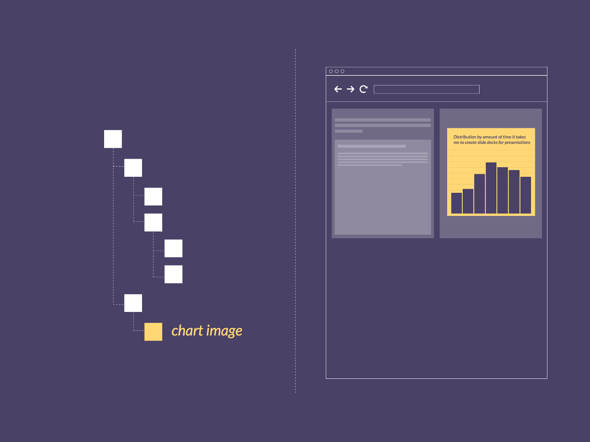
:::
::: div lg:max-w-3xl
If we wanted to add an image of a chart to this webpage, it’d be just one node in the tree. This is effectively what processing looks like on the web — it inserts an image whose pixels you can alter.

Thing is, all of these other nodes in the tree have some meaning. They’re sections, headings, body text. They’re names and addresses and dates and photos.

That chart image is like a black box for the browser — it can’t know what’s inside that image, and if it can’t know, you can’t mess with it.
:::
:::

::: div lg:grid lg:grid-cols-2 mb-12
::: div lg:border-r lg:border-warmGrey-200 mb-6
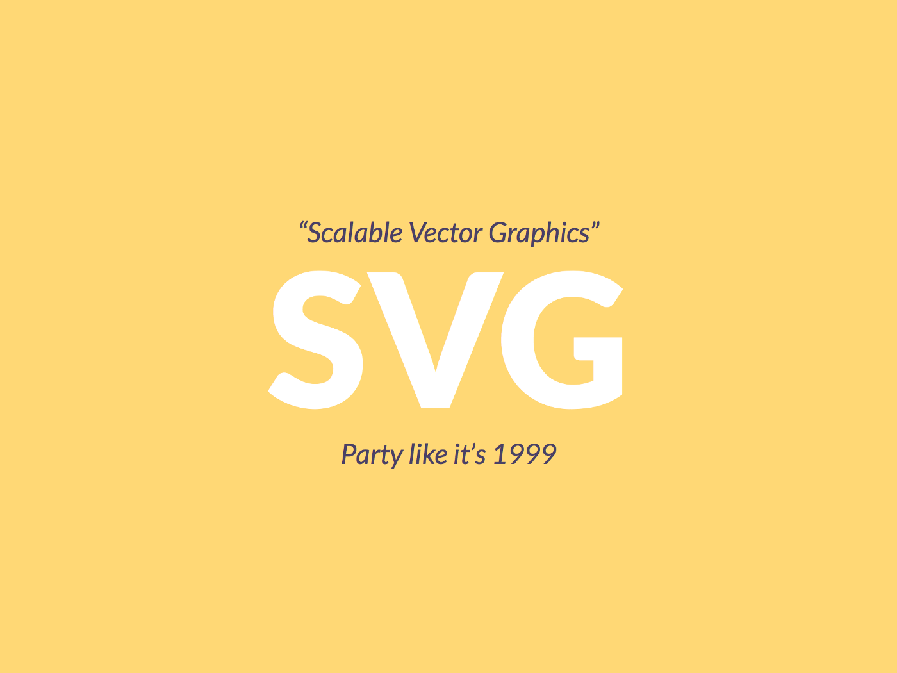
:::
::: div lg:max-w-3xl
But good news! In 1999, along came a standards body and defined SVG. At the time it was mostly about killing the (proprietary, terrible) Flash.

SVG is a way to describe vector graphics — the kind that make up charts, not photos.
:::
:::

::: div lg:grid lg:grid-cols-2 mb-12
::: div lg:border-r lg:border-warmGrey-200 mb-6
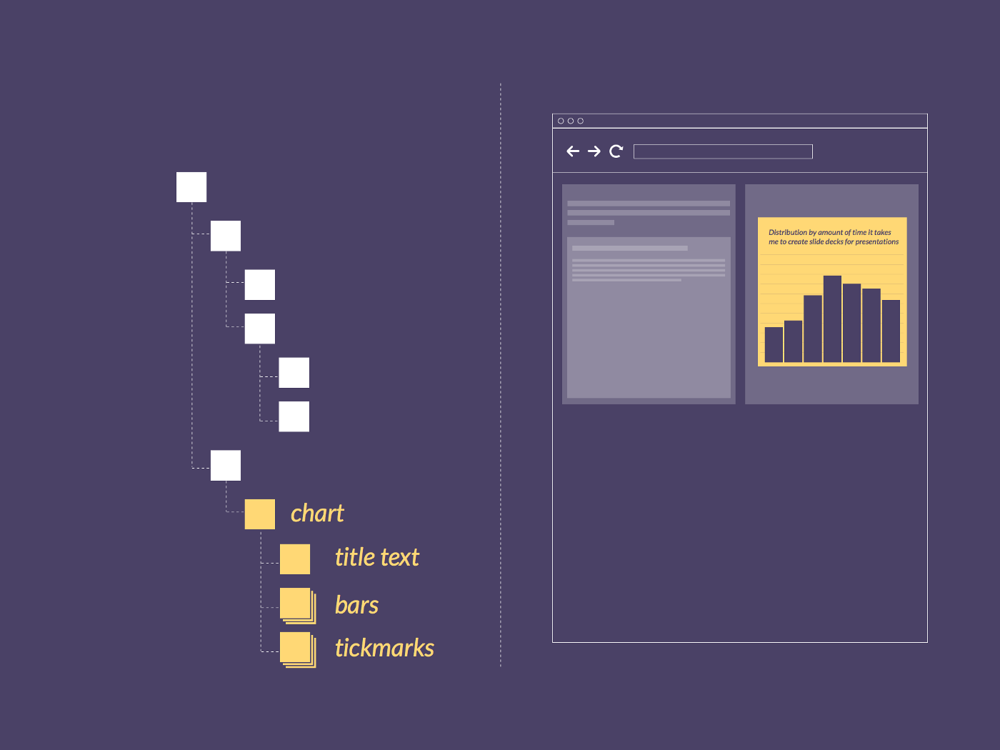
:::
::: div lg:max-w-3xl
But the most important property is that SVG content works right inside the DOM. You can take any SVG and stick it inside a web page, and it’s no longer a black box. The same tools you use for dynamically altering your content on a regular webpage, you can use to peek inside your visualization and make it dance.
:::
:::

::: div lg:grid lg:grid-cols-2 mb-12
::: div lg:border-r lg:border-warmGrey-200 mb-6

:::
::: div lg:max-w-3xl
D3 is an engine that takes in data and produces SVG. In other words, D3 makes it easy to dynamically map data onto nodes in your DOM in visually meaningful ways.
:::
:::

::: div lg:grid lg:grid-cols-2 mb-12
::: div lg:border-r lg:border-warmGrey-200 mb-6

:::
::: div lg:max-w-3xl
If you’ve been wondering why everyone and their brother can’t stop talking about D3, even when they’re in the shower, this is the reason.
:::
:::

::: div lg:grid lg:grid-cols-2 mb-12
::: div lg:border-r lg:border-warmGrey-200 mb-6
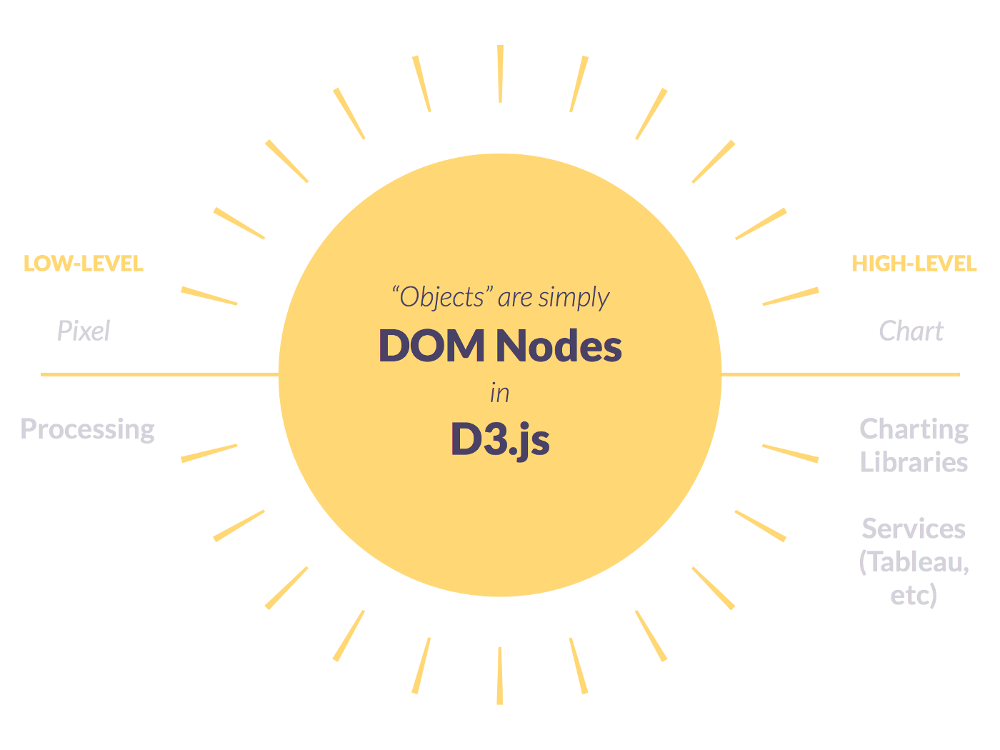
:::
::: div lg:max-w-3xl
Those “objects” we talked about are just DOM nodes! This is why D3 is such a big deal; it married the right low-level visualization constructs with the bones of the dominant medium — the DOM, the web. No proprietary plugins, and we get to think about visualizations like we think about other web content.
:::
:::

::: div lg:grid lg:grid-cols-2 mb-12
::: div lg:border-r lg:border-warmGrey-200 mb-6 justify-self-end
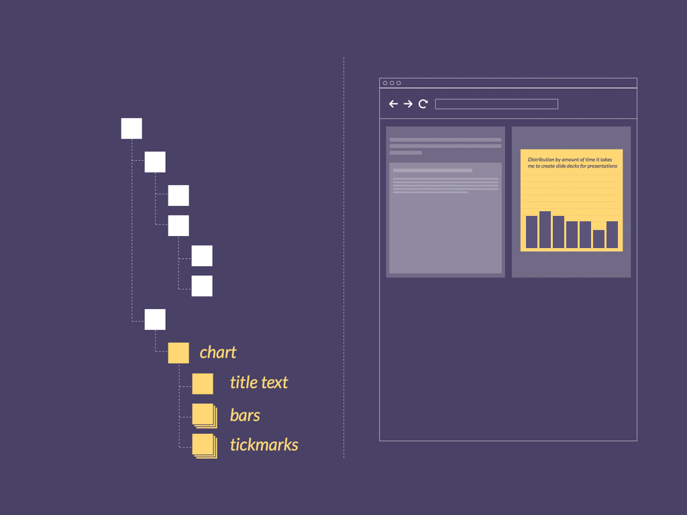
:::
::: div lg:max-w-3xl
But the coolest part about being able to address every element in our visualizations individually like this is the power to animate them.

Right now, there are two dominant paths to animation: JavaScript animations and CSS animations.
:::
:::

::: div lg:grid lg:grid-cols-2 mb-12
::: div lg:border-r lg:border-warmGrey-200 mb-6
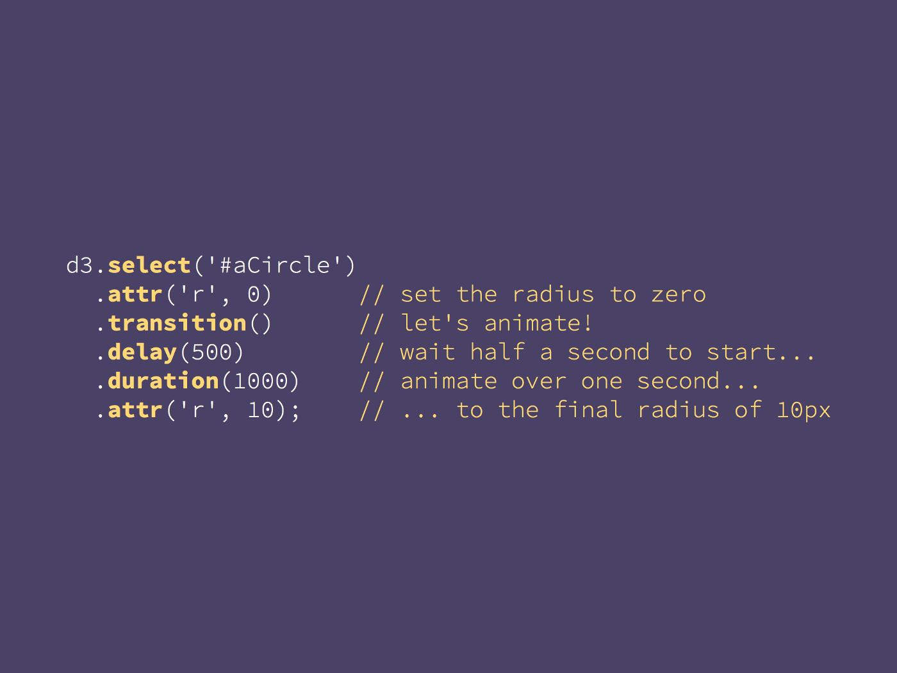
:::
::: div lg:max-w-3xl
This is what it looks like to animate a dot so it appears to “grow” from nothing with D3, in JavaScript.
:::
:::

::: div lg:grid lg:grid-cols-2 mb-12
::: div lg:border-r lg:border-warmGrey-200 mb-6
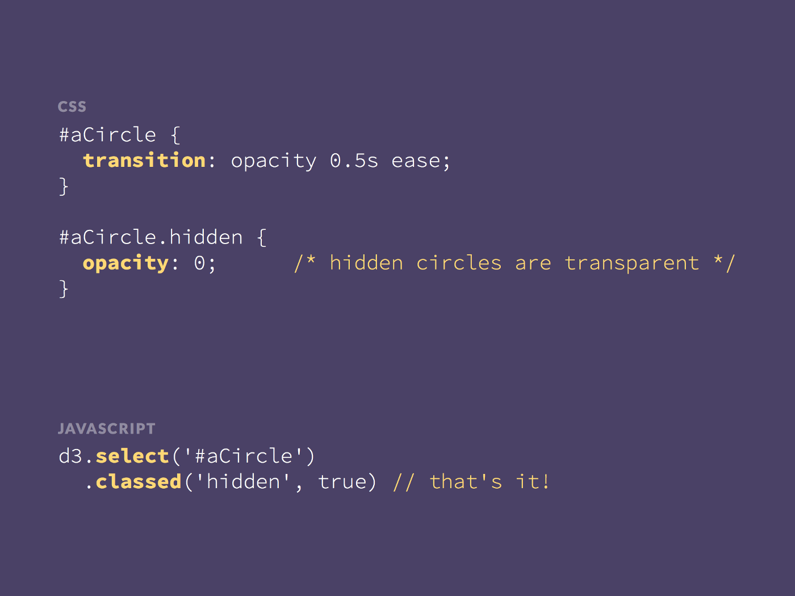
:::
::: div lg:max-w-3xl
With CSS animations, it’s more about transitioning between states. For example, say we wanted to hide something by fading it out over half a second. You set up the transition in CSS, and apply/remove the state in JS.
:::
:::

::: div lg:grid lg:grid-cols-2 mb-12
::: div lg:border-r lg:border-warmGrey-200 mb-6
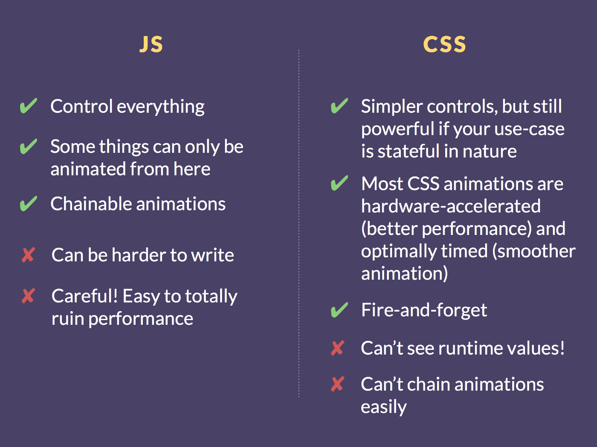
:::
::: div lg:max-w-3xl
There are pros and cons to each approach, but they’re really different tools. They aren’t mutually exclusive, I use both in the same projects for different purposes.

The best rule of thumb has to do with statefulness. If the thing being animated can be seen as having one of several states, it’s probably a good candidate for CSS animation versus JS animation.
:::
:::

::: div lg:grid lg:grid-cols-2 mb-12
::: div lg:border-r lg:border-warmGrey-200 mb-6
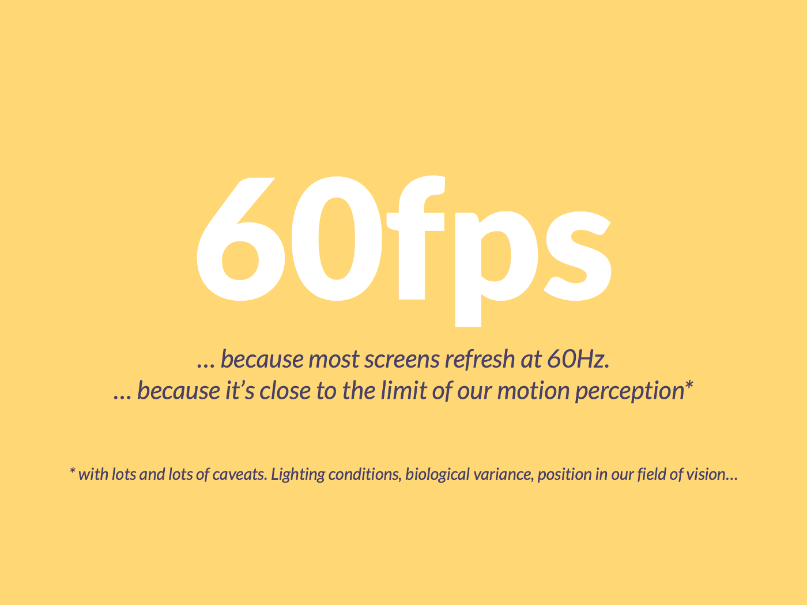
:::
::: div lg:max-w-3xl
I keep coming back to performance tradeoffs and hardware acceleration. What we’re really reaching for is animations that consistently produce 60fps. There are a few different factors affecting this…
:::
:::

::: div lg:grid lg:grid-cols-2 mb-12
::: div lg:border-r lg:border-warmGrey-200 mb-6
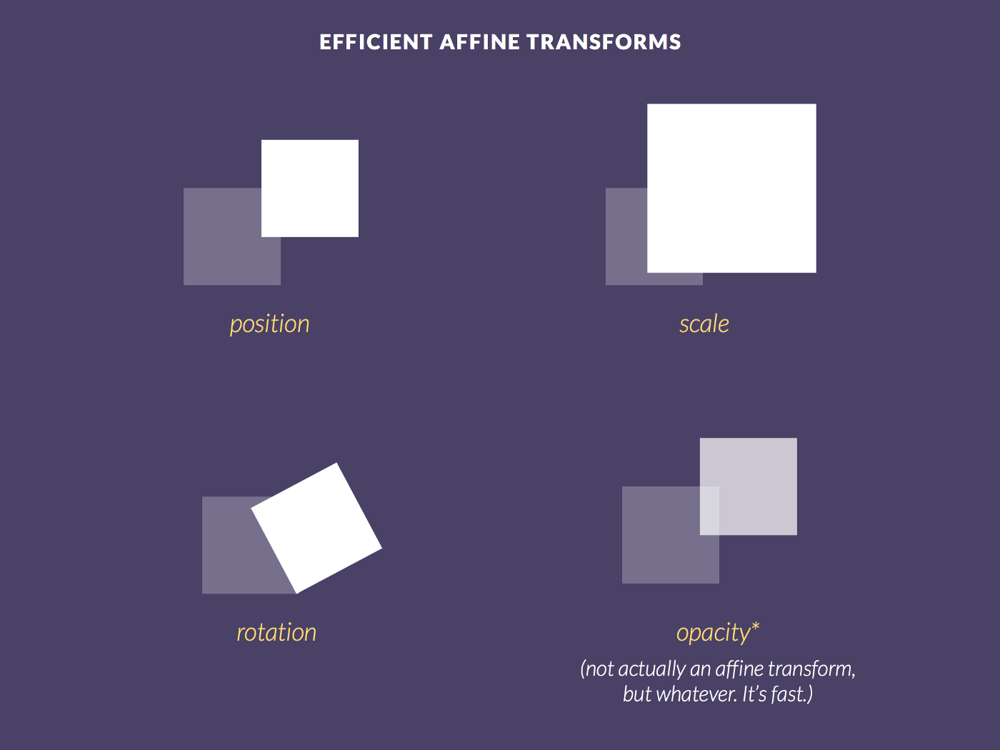
:::
::: div lg:max-w-3xl
The most important of which is hardware acceleration.

Most computers nowadays have 3d graphics hardware because games! But they’re basically really fast engines for calculating certain kinds of math, mainly matrix multiplications.

We get these kinds of animations “for free”, because they are powered by hardware. They don’t impose on the CPU, and because they’re efficient, that means that it is kinder to your batteries and your laptop fans don’t spin up.

What happens when we use animations that aren’t free?
:::
:::

::: div lg:grid lg:grid-cols-2 mb-12
::: div lg:border-r lg:border-warmGrey-200 mb-6 justify-self-end
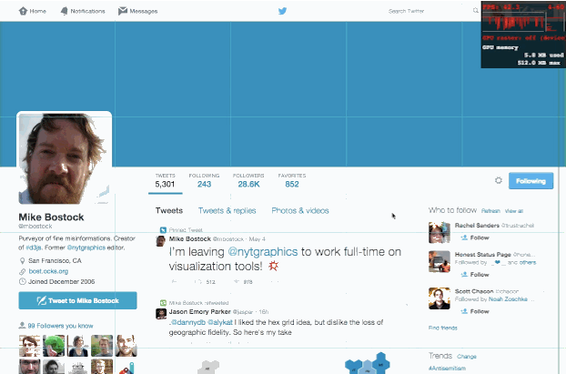
:::
::: div lg:max-w-3xl
Well, we’re basically forcing the browser to redraw every pixel, every frame. Chrome has some very useful tools for inspecting paint performance and identifying bottlenecks. Everything that you see flashing green is being redrawn by the browser.

Notice how some kinds of scrolling don’t trigger repaints at all? That’s affine transforms in action. The less green you see, the less hard your computer needs to work to render fluid animation.
:::
:::

::: div lg:grid lg:grid-cols-2 mb-12
::: div lg:border-r lg:border-warmGrey-200 mb-6
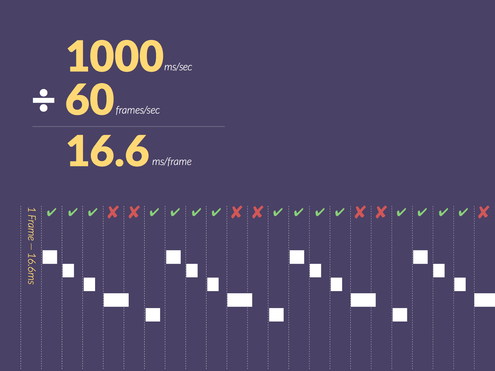
:::
::: div lg:max-w-3xl
Basically all of that green repainting needs to fit into 16.6ms. Why?

Because when we don’t, we get an apparently lower framerate. Lower is okay, so long as it’s consistent — but the problem here is that it stutters, rendering smoothly except for when it overruns the frame budget.
:::
:::

::: div lg:grid lg:grid-cols-2 mb-12
::: div lg:border-r lg:border-warmGrey-200 mb-6
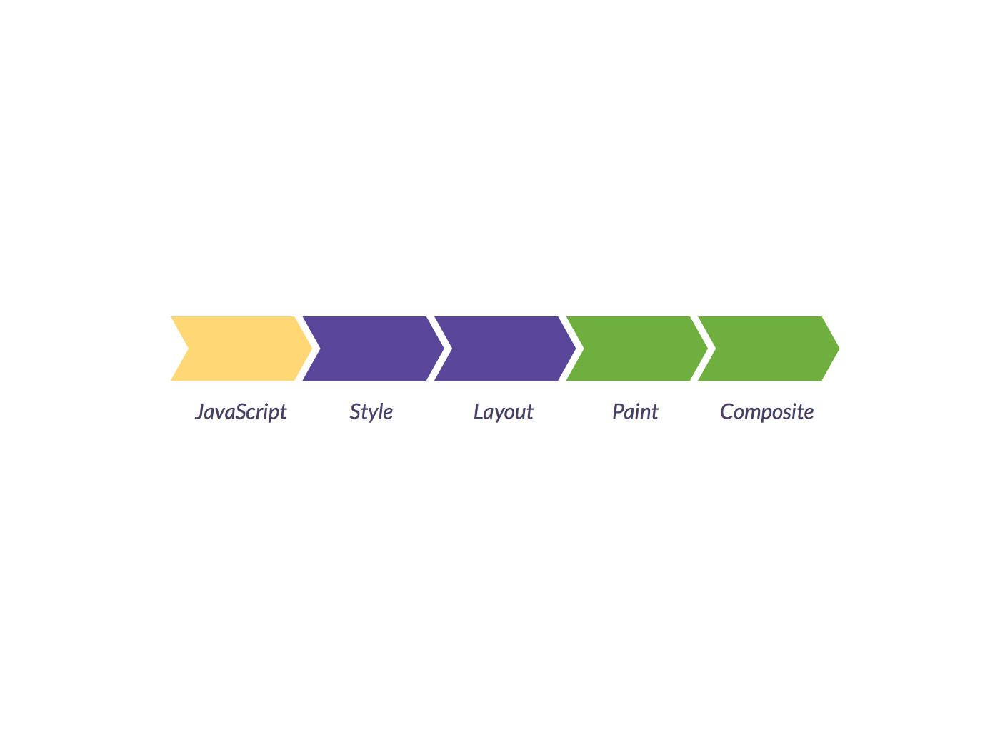
:::
::: div lg:max-w-3xl
And the reality is even worse: you don’t have all of those 16.6ms just for painting. Everything the browser needs to do to generate a frame shares that budget. All of the JS computation. All of the style calculations. All of the layout calculations. Then the painting, and finally the compositing, where the “free” hardware-accelerated stuff gets layered together with the manually-drawn bits.

If you’re careful, you can find ways to eliminate stages here by not doing something that would require them — but that will also constrain your design options.
:::
:::

::: div lg:grid lg:grid-cols-2 mb-12
::: div lg:border-r lg:border-warmGrey-200 mb-6
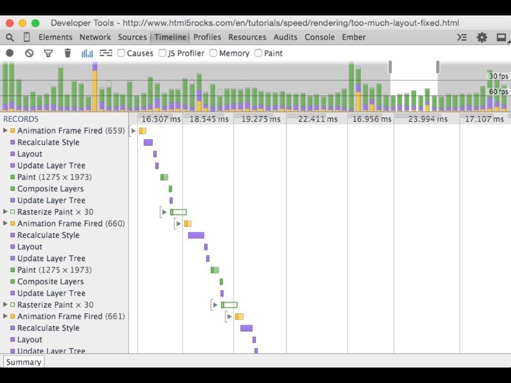
:::
::: div lg:max-w-3xl
Fortunately, chrome also has tooling to help you profile and troubleshoot animation: the timeline inspector.

This is a well-behaved app. 60/30fps lines in the bar chart up top. Tall bars that cross these thresholds are basically overrunning their frame budget, taking much longer than 16.6ms to deliver a frame.

Where there are spikes, you can see the waterfall breakdown to understand what parts of the pipeline are bottlenecks.

The question, as always, is how will it perform on slower computers, like mobile devices and older machines. The goal isn’t to hit 60fps, it’s to leave extra room — don’t even come near the 16.6ms budget — so your animations degrade to 60fps on less capable machines.
:::
:::

::: div lg:grid lg:grid-cols-2 mb-12
::: div lg:border-r lg:border-warmGrey-200 mb-6
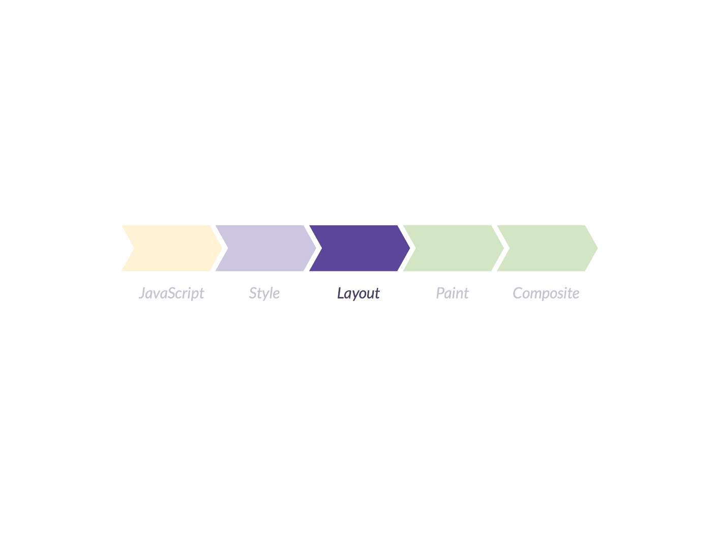
:::
::: div lg:max-w-3xl
It’d be awesome if I was done with the tricky news, but that’s not the way that visualization works. Everything loops back into everything, right?

So, not to drag the DOM back into it, but it turns out that one of the most expensive steps in the pipeline is Layout.
:::
:::

::: div lg:grid lg:grid-cols-2 mb-12
::: div lg:border-r lg:border-warmGrey-200 mb-6
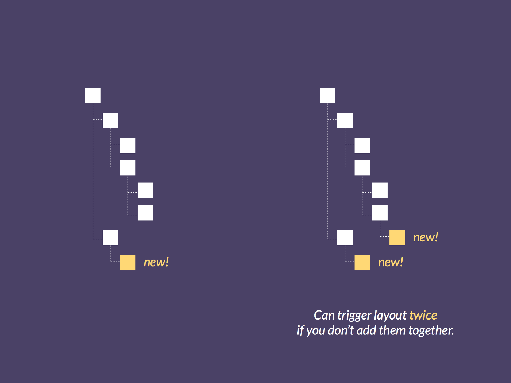
:::
::: div lg:max-w-3xl
There’s a huge cost every time you alter the DOM from javascript, because the browser needs to stop and think about whether the onscreen layout has changed. If you make two changes at different times, you pay that stop-everything-and-reflow tax… Twice. Very bad.
:::
:::

::: div lg:grid lg:grid-cols-2 mb-12
::: div lg:border-r lg:border-warmGrey-200 mb-6
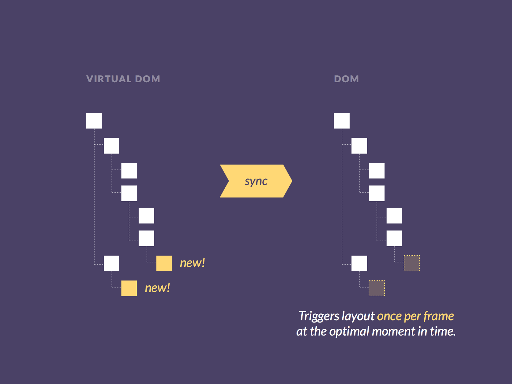
:::
::: div lg:max-w-3xl
There are solutions that are starting to gain traction. A popular one is Facebook’s React.js framework, which maintains a “virtual” DOM alongside the real one. Every change that you make with React happens to the virtual DOM. React efficiently compares and syncs the changes to the real DOM, once per frame, at just the right moment.
:::
:::

::: div lg:grid lg:grid-cols-2 mb-12
::: div lg:border-r lg:border-warmGrey-200 mb-6

:::
::: div lg:max-w-3xl
You can see why animation is a bit of a minefield. Collectively, the war on jerky animation on the web is called “Jank,” and you’ve just seen the front lines.

For more information about eliminating jank in your interfaces, check out jankfree.org.
:::
:::

::: div lg:grid lg:grid-cols-2 mb-12
::: div lg:border-r lg:border-warmGrey-200 mb-6
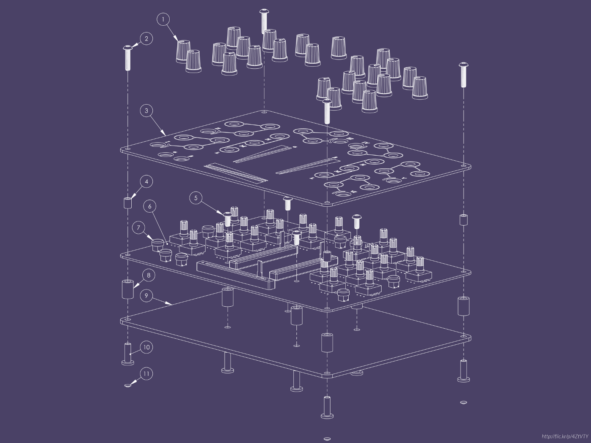
:::
::: div lg:max-w-3xl
But zooming out, it’s important to remember that building smooth animations is just the mechanics, the cost of entry. What really matters is what you do with this capability, not the inner workings of the machinery.
:::
:::

::: div lg:grid lg:grid-cols-2 mb-12
::: div lg:border-r lg:border-warmGrey-200 mb-6
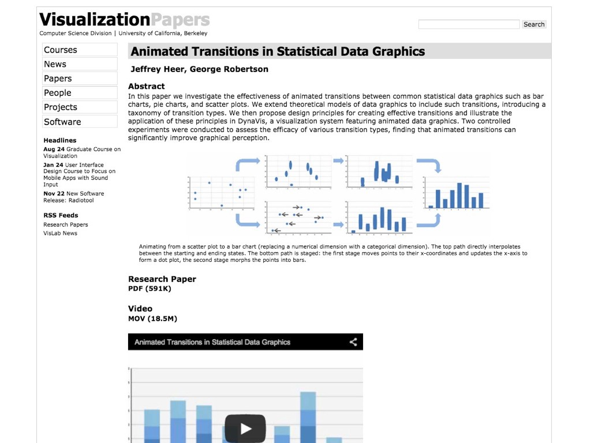
:::
::: div lg:max-w-3xl
[Heer and Robertson have a paper](http://vis.berkeley.edu/papers/animated_transitions/) that’s squarely about improving visualizations through animation.

What I haven’t seen yet is a well-assembled style guide like the ones that Apple and Google have authored for their respective platforms. Something that prescribes timings and general best practices.

This is something missing from our field.
:::
:::

::: div lg:grid lg:grid-cols-2 mb-12
::: div lg:border-r lg:border-warmGrey-200 mb-6

<iframe src="https://player.vimeo.com/video/93206523" style="position:absolute;top:0;left:0;width:100%;height:100%;" frameborder="0" allow="autoplay; fullscreen" allowfullscreen></iframe>

:::
::: div lg:max-w-3xl
Unsurprisingly, the closest thing to it comes not from science, but from art. Two of Disney’s elder animators coined the twelve principles of animation in a book from 1981 called “The illusion of Life”.

What’s shown is just one of the [twelve principles](http://the12principles.tumblr.com/) — Disney’s take on how to time animations. It’s easy to see the legacy of Disney’s animators in modern, animated interfaces.

If you’ve never seen them before, make it the next thing you read about. We don’t need to reinvent the wheel here. This is the map to our future.
:::
:::

::: div lg:grid lg:grid-cols-2 mb-12
::: div lg:border-r lg:border-warmGrey-200 mb-6

:::
::: div lg:max-w-3xl
If driving a car was like building visualizations for the web, every driver would have to be a mechanical engineer capable of building an engine from scratch before they were allowed to put a key in the ignition and drive.

Part of fixing that it is spreading the load across more people than before. Part of it is our growing proficiency with the craft, and the growing maturity of our tools.

There’s work happening to make browsers better, but that’s largely out of our hands. The place where we can have the most impact is in putting useful abstractions somewhere between D3 and the higher-level charting libraries — The tooling that will allow anyone to build the next tableau, not another chart type in today’s tableau.

We’re starting to see this in tools like [Vega](http://trifacta.github.io/vega/), which allow you to skip a lot of D3 boilerplate but which still expose a meaningful subset of D3’s power.

The history of computing is a story about abstractions, how we’ve hidden complex things away.

We finally have the right foundations on the web — D3 — to build for the modern printing press. We are starting to have the right diagnostic tooling to make animation not impose a huge creative tax on us. We’re starting to have higher-level ideas about squeezing more performance out of the existing technology.
:::
:::

::: div lg:grid lg:grid-cols-2 mb-12
::: div lg:border-r lg:border-warmGrey-200 mb-6

:::
::: div lg:max-w-3xl
In the meantime, go build awesome things, because there’s nothing better we can do to improve the state of our craft.
:::
:::

::: div my-20 py-10 border-t border-b border-warmGrey-200
::: div max-w-screen-xl mx-auto 

:::
:::

